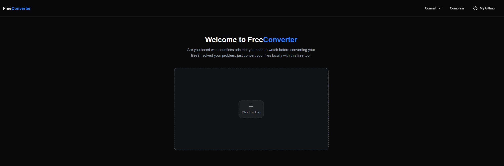

## FreeFileconverter

**No Ads. Just Local. Be Smart.**

Are you bored with countless ads that you need to watch before converting your files?  
I solved your problem - just convert your files locally with this free tool.

---

### How It Works

**Upload**  
Drag your files into the browser.

**Convert**  
Processing happens in your browser's RAM via WASM (WebAssembly).  
No uploads. No servers. No tracking.

**Download**  
Save your new file instantly.

### Screenshots

### Dev info
To build app I used:

1. React with Next.js
2. Tailwind for design
3. Redux for history what you have converted