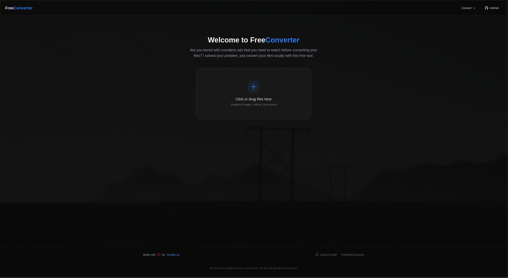
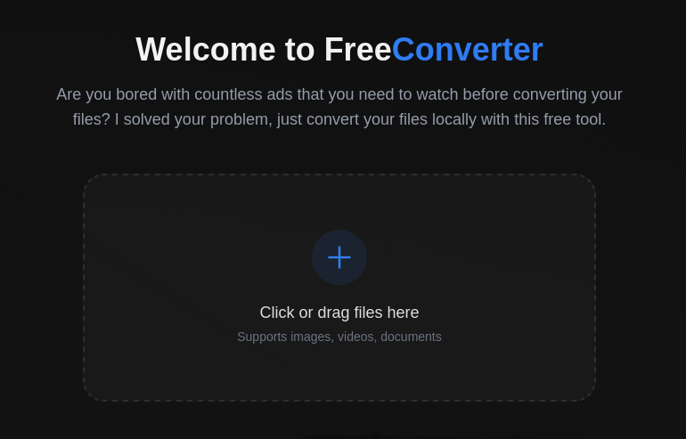
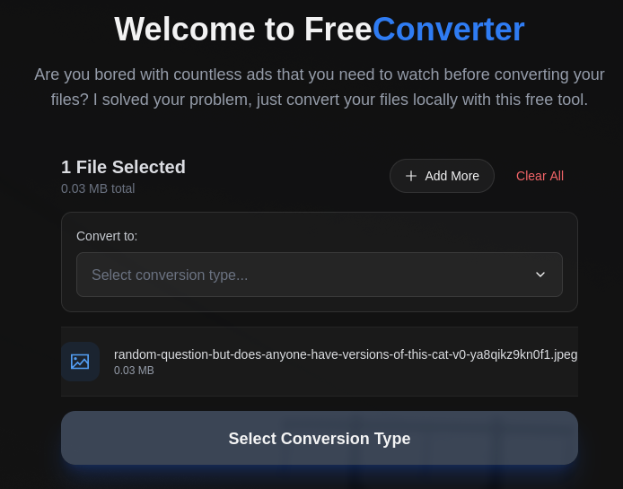
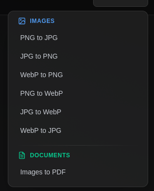
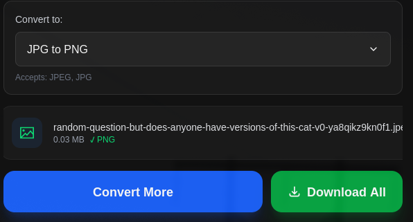
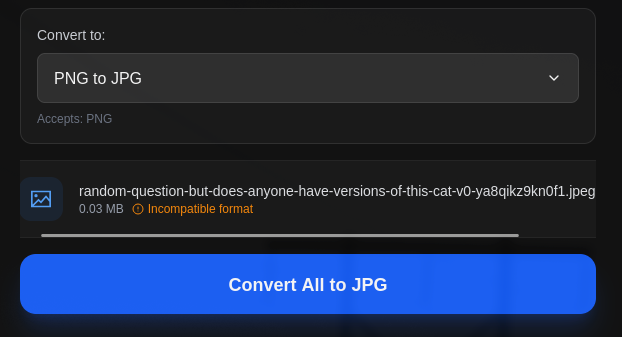

# FreeConverter

**No Ads. Just Local. Be Smart.**

Are you tired of countless ads you need to watch before converting your files? FreeConverter solves this problem — convert your files locally in your browser with no uploads, no servers, and no tracking.

---

## How It Works

1. **Upload** — Drag & drop your files or click to select
2. **Convert** — Processing happens entirely in your browser using WebAssembly and Canvas API
3. **Download** — Save your converted files instantly

---

## Screenshots

### Main Interface



### File Converter



### File Selection



### Conversion Formats



### Ready to Download



### Error Handling



---

## Supported Conversions

### Images
- PNG ↔ JPG
- PNG ↔ WebP
- JPG ↔ WebP
- WebP ↔ PNG/JPG

### Documents
- Images → PDF (combine multiple images into one PDF)

---

## Tech Stack

- **React** - UI framework
- **Next.js** - React framework with static export
- **TypeScript** - Type safety
- **Tailwind CSS** - Styling
- **jsPDF** - PDF generation
- **Canvas API** - Image format conversion

---

## Development

### Prerequisites
- Node.js 18+
- npm

### Installation

```bash
git clone https://github.com/Smudy-ux/FileConverter.git
cd FileConverter
npm install
```

### Run Development Server

```bash
npm run dev
```

Open [http://localhost:3000](http://localhost:3000)

### Build for Production

```bash
npm run build
```

Output will be in the `dist/` directory.

---

## Privacy

All conversions happen locally in your browser. Your files are never uploaded to any server. This means:
- No file size limits (limited only by your RAM)
- No registration required
- No tracking
- Works offline after initial load

---

## License

MIT

---

Made with ❤️ by [Smudy-ux](https://github.com/Smudy-ux)
